# AS-PagerDuty-Integration

Author: Accelerynt

For any technical questions, please contact info@accelerynt.com  

This playbook is intended to be run from an Azure Sentinel alert. It will create a PagerDuty incident with the related Azure Sentinel incident information and post a comment to the Azure Sentinel incident with the PagerDuty incident link.

#

The following items are required under the template settings during deployment: 

* A PagerDuty API access key.
* The id of the service the PagerDuty incident is to be created in. 
* The email address of the PagerDuty user associated with the above access key.

 # 
 To create a PagerDuty API access key:
 
 Log into your PagerDuty account and under the "Integrations" menu option, select "API Access Keys". From the page, click the "Create New API Key" button.
 
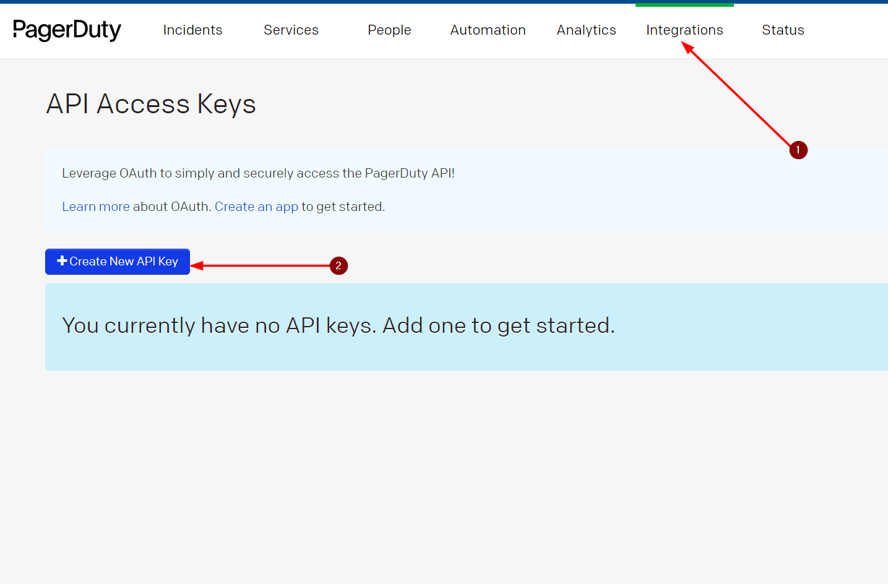

 Add a description and leave the Read-only API Key checkbox **unchecked** as the API key will be used to make post requests.
 
 Click the "Create Key" button in the dialogue box and note the resulting API Key value, as it will be needed in the deployment of this playbook.
 
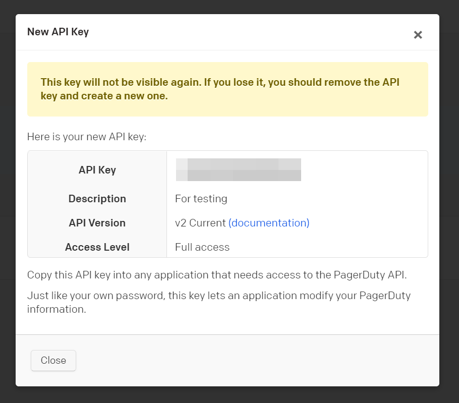

 # 
 To create a PagerDuty Service:
 
 In your PagerDuty account under the "Services" menu option, select "Service Directory". From the Service Directory page, click the "New Service" button.
 
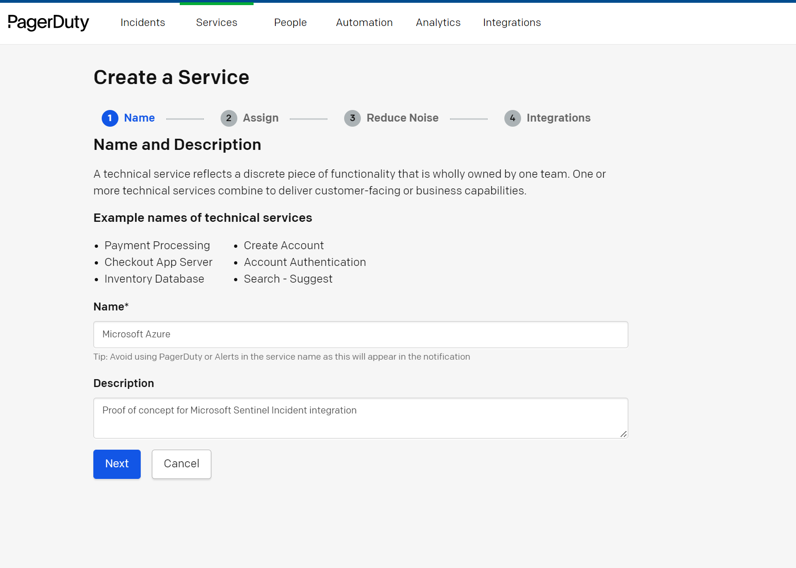

 Give your service a name and optional description, click next, and then select an escalation policy.

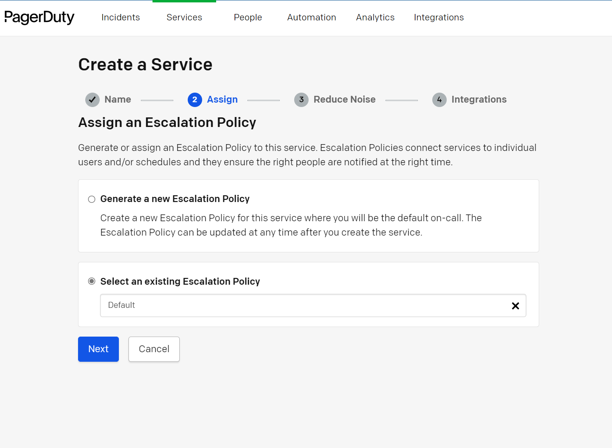

 Select your desired noise reduction option.

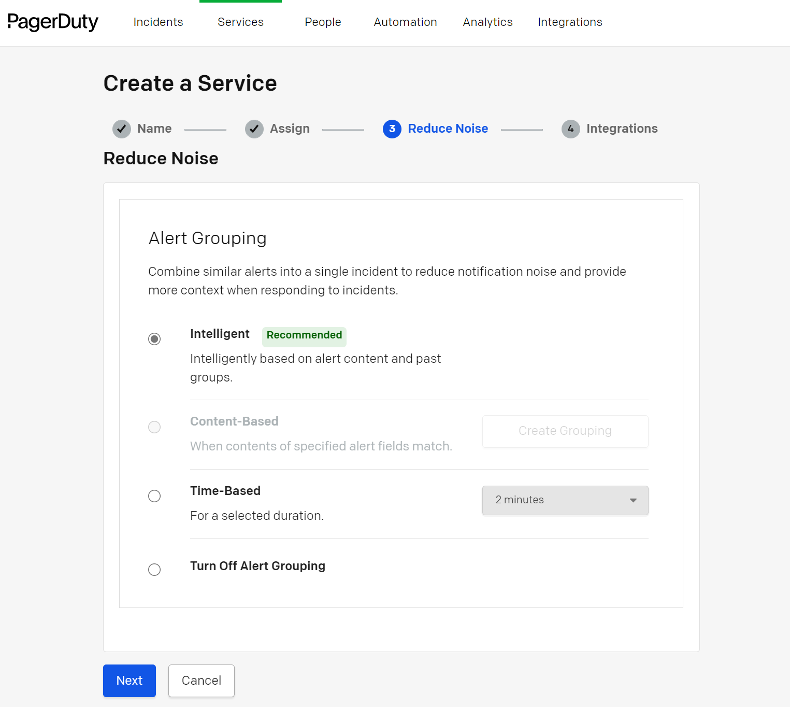

Finally, select the Microsoft Azure option under the Integrations section, then click "Create Service".

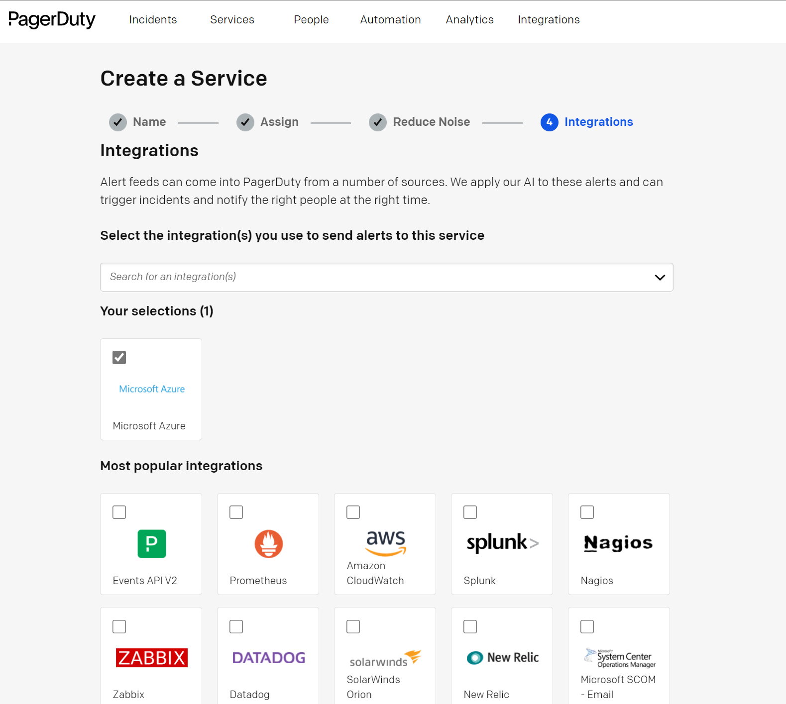

You will be redirected to the page for the service you have just created. The service id needed for this playbook can be found in the URL of this page in the following format:
https://{YOUR_ORG}.pagerduty.com/service-directory/{**SERVICE_ID**}/integrations?welcome=1

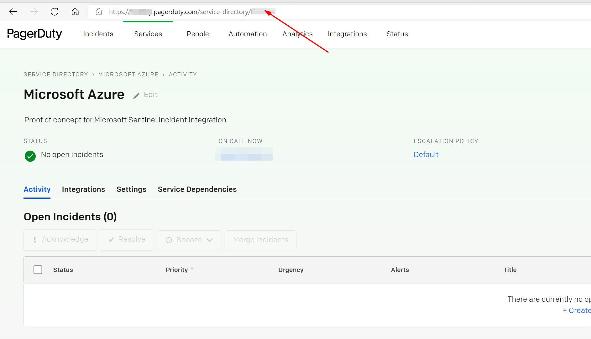

#
To configure and deploy this playbook:
 
Open your browser and ensure you are logged into your Azure Sentinel workspace. In a separate tab, open the link to our playbook on the Arbala Security GitHub Repository:

https://github.com/Arbala-Security/AS-PagerDuty-Integration

                                                 

From there, click the “Deploy to Azure” button at the bottom and it will bring you to the Custom Deployment Template.

In the first section:  

* Select the “**Subscription**” and “**Resource Group**” from the dropdown boxes you would like the playbook deployed to.  

In the **Parameters** section:   

* **Playbook Name**: This can be left as “AS-PagerDuty-Integration” or you may change it.  

* **API Access Key**: Enter the value of the API access key created from the first section.

* **Service Id**: Enter the service id from the second section.

* **Email Addresses**:  Enter the email address of the PagerDuty user associated with the API access key. 

Towards the bottom, click on “Review + create”. 

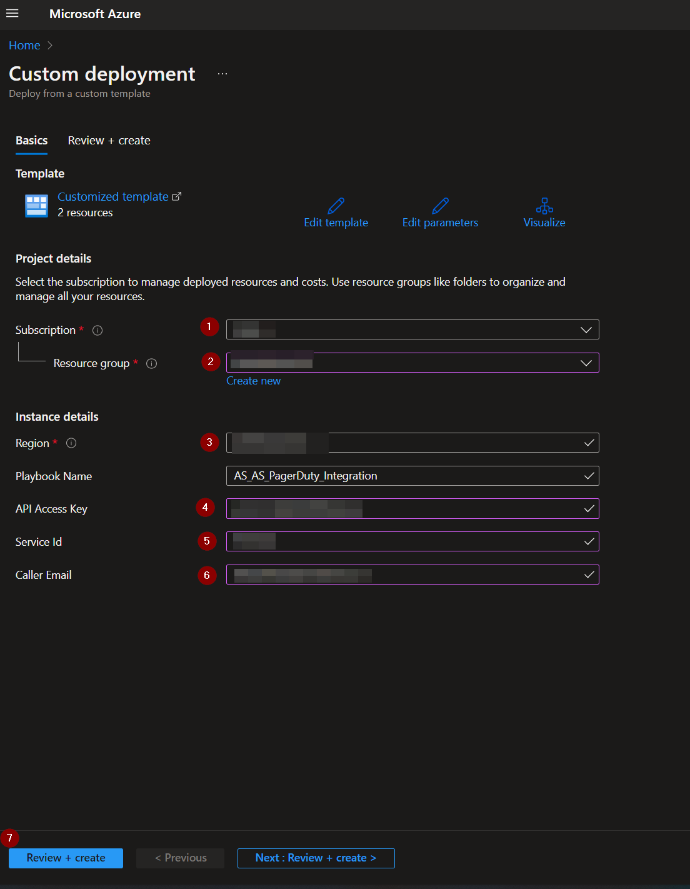

Once the resources have validated, click on "Create".

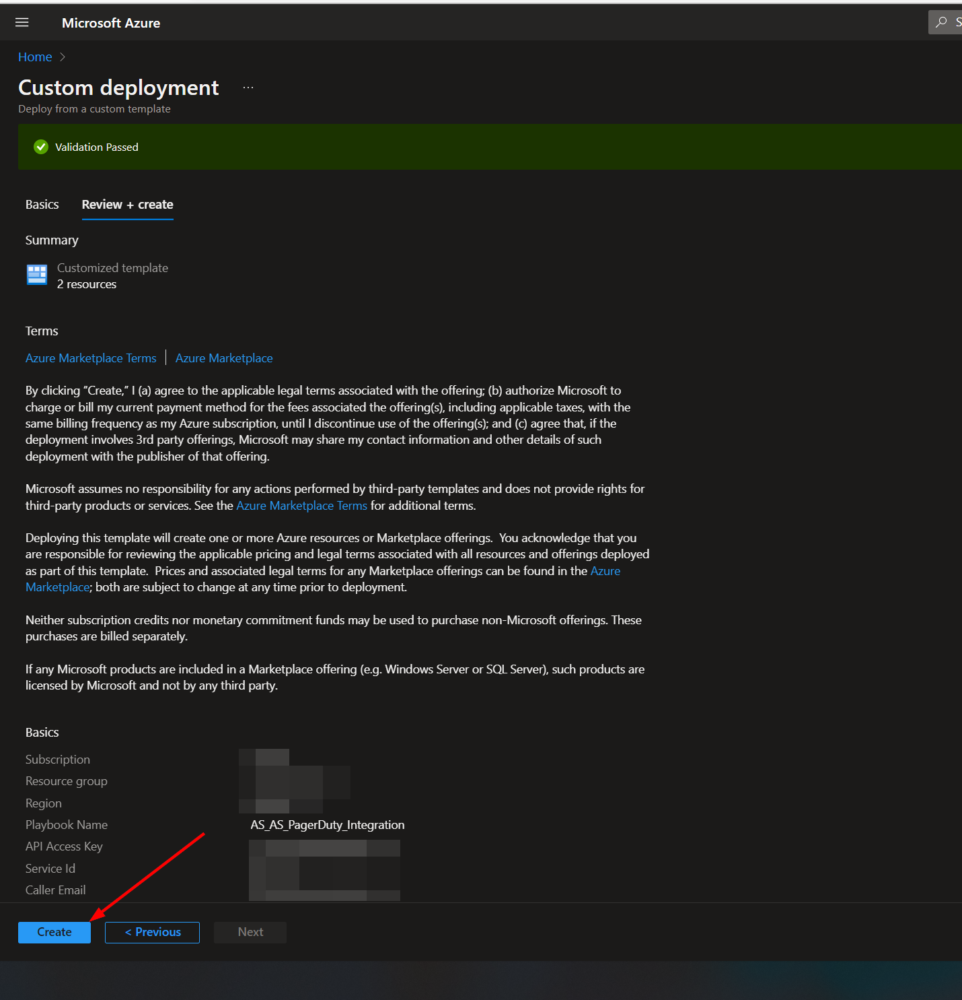

The resources should take around a minute to deploy. Once the deployment is complete, you can expand the "Deployment details" section to view them.
Click the one corresponding to the Logic App.

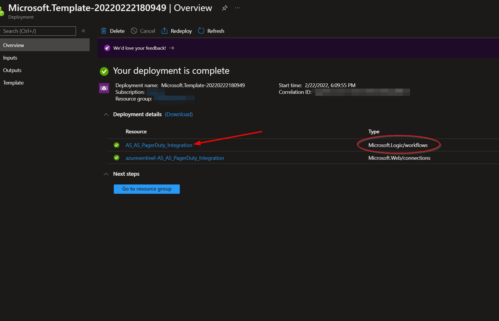

Click on the “Edit” button. This will bring us into the Logic Apps Designer.

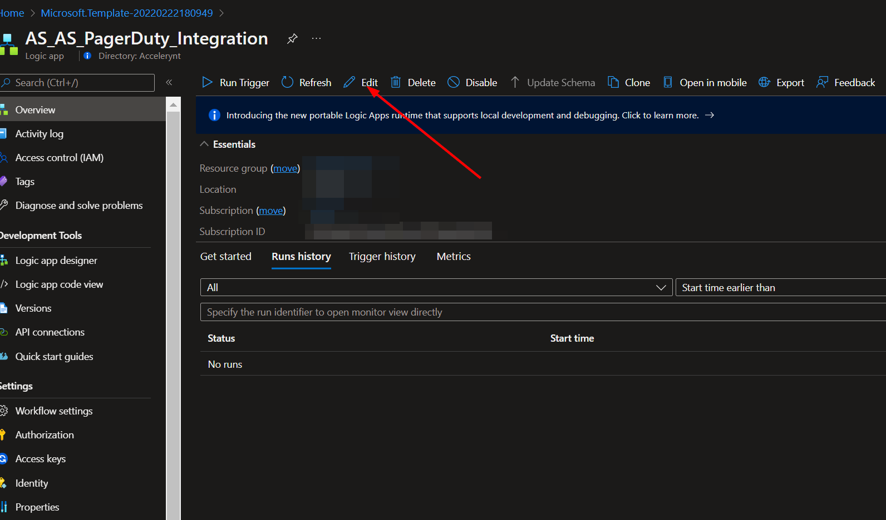

There are three steps labeled "Connections" that use a connection created during the deployment of this playbook. This connection will either need to be authorized in each of these three steps, or an existing authorized connection may be alternatively selected before the playbook can be run.  

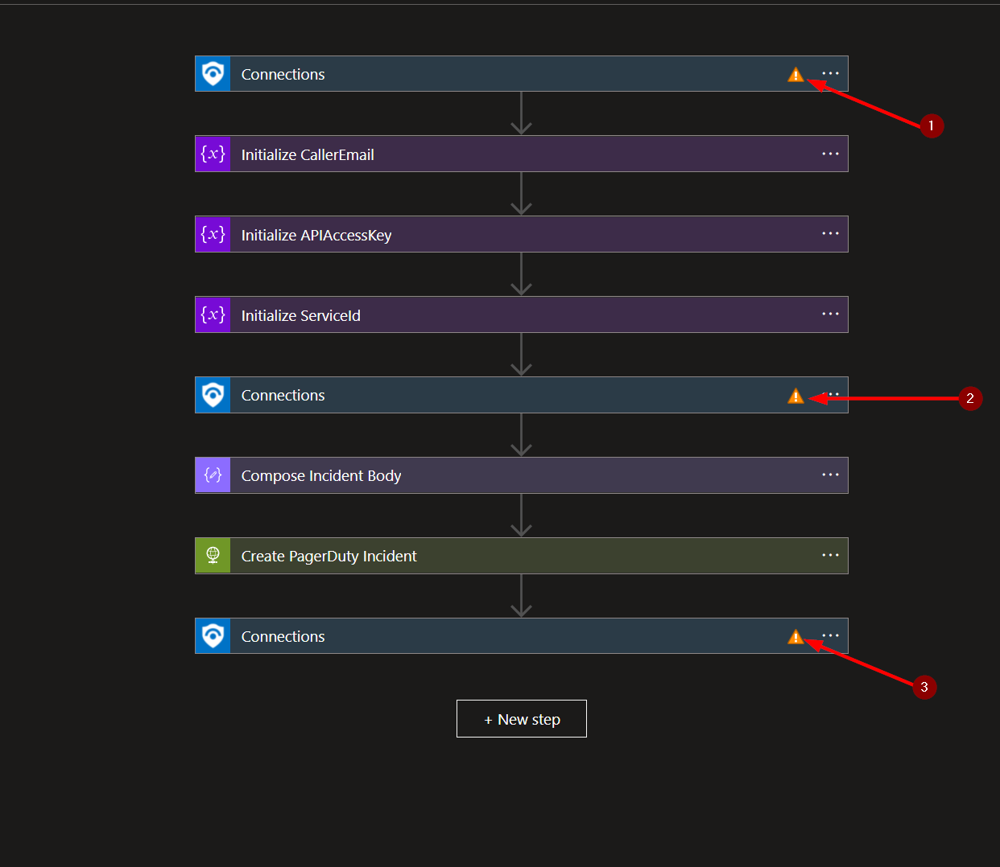

To validate the connection created for this playbook connection, expand one of the "Connections" steps and click the exclamation point icon next to the name matching the playbook.
                                                                                                
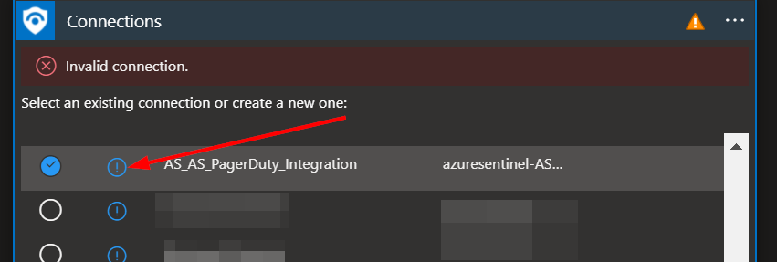

When prompted, sign in to validate the connection.                                                                                                
                                                                                                
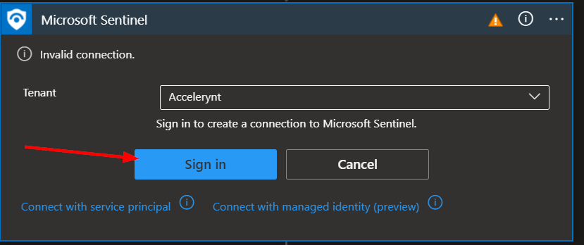                                                                                                                             
                                                                                                                             
Once all three connection steps have been updated, click the save button.

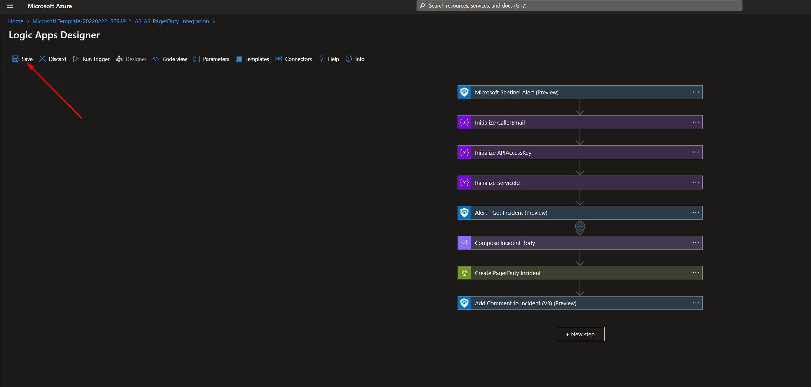  
                                                                                                
#
To run this playbook on an alert in Azure Sentinel, navigate to "Incidents" under "Threat Management" in the left-hand menu.

Click the "View full details" button in the bottom right-hand corner.

In the middle window, scroll to the right and click "View playbooks".

Find the AS-PagerDuty-Integration playbook and click run.

The playbook will create a PagerDuty incident with the related Azure Sentinel incident information and post a comment to the Azure Sentinel incident with the PagerDuty incident link.
